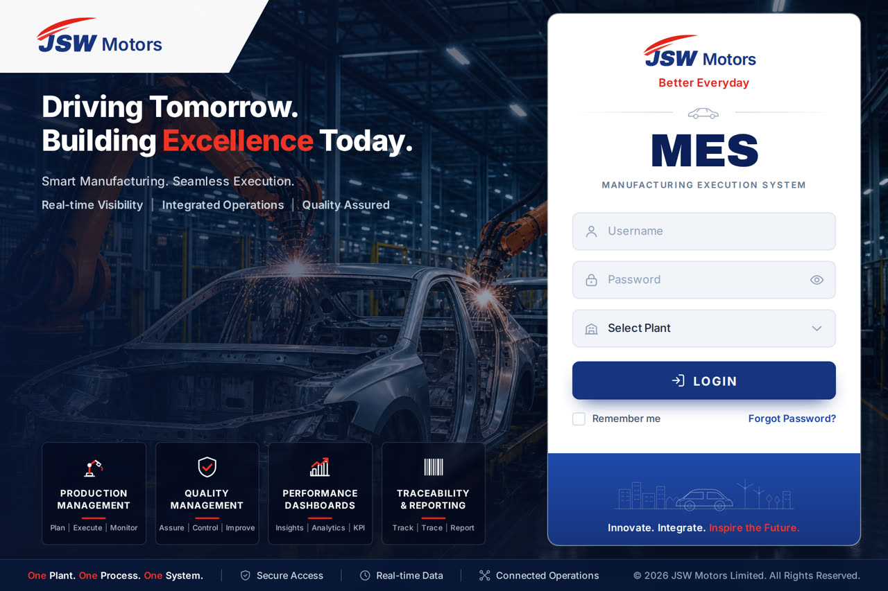

# JSW Motors — MES Login

Pixel-faithful implementation of the JSW Motors **Manufacturing Execution System** sign-in
screen, built with Vite, React, TypeScript and Tailwind CSS v4.



## Getting started

```bash
npm install
npm run dev          # http://localhost:5173
```

| Script             | Purpose                                                       |
| ------------------ | ------------------------------------------------------------- |
| `npm run dev`      | Start the Vite dev server                                     |
| `npm run build`    | Type-check and produce a production bundle in `dist/`         |
| `npm run preview`  | Serve the production bundle on port 4173                      |
| `npm run lint`     | Run oxlint                                                    |
| `npm run shots`    | Capture the page at three viewports (see *Visual checks*)     |
| `npm run check:ui` | Exercise the form states in a headless browser                |

## What is on the page

**Left — brand and capability rail**

- Angled white plate in the top-left corner carrying the JSW Motors lockup.
- Headline "Driving Tomorrow. Building **Excellence** Today." with the supporting lines
  "Smart Manufacturing. Seamless Execution." and
  "Real-time Visibility | Integrated Operations | Quality Assured".
- Four capability pillars — Production Management, Quality Management,
  Performance Dashboards, Traceability & Reporting — each with its own icon,
  red rule and three-part tag line.

**Right — sign-in card**

- JSW Motors lockup with the "Better Everyday" tagline and a car-ornamented divider.
- `MES` title over "Manufacturing Execution System".
- Username, password (with reveal toggle) and plant selector fields.
- Primary `LOGIN` action, "Remember me" checkbox and "Forgot Password?" link.
- Blue vision strip with connected-plant line art and
  "Innovate. Integrate. **Inspire the Future.**"

**Footer rail** — "One Plant. One Process. One System.", the Secure Access / Real-time Data /
Connected Operations assurances, and the copyright line.

## Behaviour

The form is self-contained and ready to be wired to an auth service:

- Client-side validation for credentials and plant selection, with the message clearing
  as soon as the operator edits a field.
- Password reveal toggle.
- "Remember me" persists the username to `localStorage` under `jsw-mes.remembered-user`
  and restores it on the next visit.
- Submitting shows a spinner; replace the `window.setTimeout` placeholder in
  `src/components/LoginCard.tsx` with the real authentication call.

Plant options live in `src/data/plants.ts` and the capability pillars in
`src/data/features.ts`, so both lists can be changed without touching layout code.

## Brand assets

The logo, car divider, skyline plate and pillar icons are hand-built SVG components under
`src/components/brand` and `src/components/icons`, so they stay sharp at any density and
recolour from the theme tokens rather than shipping raster files.

The shop-floor photograph is `src/assets/images/factory-bg.jpg`. To use a different
approved photograph, replace that file — no code change is needed.

Brand colours are declared once as Tailwind theme tokens in `src/index.css`:

| Token             | Value     | Used for                          |
| ----------------- | --------- | --------------------------------- |
| `jsw-red`         | `#e1251b` | Logo swoosh, rules, accents       |
| `jsw-red-bright`  | `#ef3325` | Accents over dark backgrounds     |
| `jsw-blue`        | `#16357f` | Wordmark, primary button          |
| `jsw-blue-light`  | `#1f4bab` | Hover and focus states            |
| `jsw-navy`        | `#0b2059` | `MES` title                       |
| `jsw-navy-deep`   | `#071736` | Backdrop wash, footer rail        |

## Visual checks

`npm run shots` and `npm run check:ui` drive a headless Chromium via Playwright and write
PNGs to `/tmp/shots`. They need the browser binary and a running preview server:

```bash
npx playwright install chromium
npm run build && npm run preview &
npm run shots
npm run check:ui
```

## Layout notes

The page is a single flex column: a hero row that splits into the brand rail and the sign-in
card, with the status bar pinned beneath it. Below the `lg` breakpoint the two columns stack,
the pillars fall into a 2×2 grid, and the headline scales with the viewport via `clamp()`.

## Project structure

```
src/
├── assets/images/       shop-floor backdrop
├── components/
│   ├── brand/           JswLogo, CarDivider, SkylineArt
│   ├── icons/           pillar icons and UI glyphs
│   ├── BrandBanner.tsx  angled corner plate
│   ├── FeatureCard.tsx  one capability pillar
│   ├── HeroSection.tsx  headline + pillar grid
│   ├── LoginCard.tsx    sign-in form
│   └── StatusBar.tsx    footer rail
├── data/                plants and capability pillars
├── pages/LoginPage.tsx  full-page composition
└── index.css            Tailwind theme tokens
```
